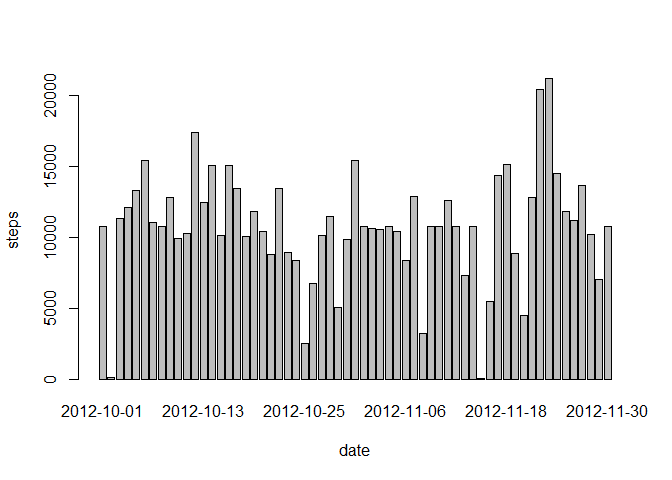

# Reproducible Research: Peer Assessment 1

Assignment makes use of data from a personal activity monitoring device. This device collects data at 5 minute intervals through out the day. The data consists of two months of data from an anonymous individual collected during the months of October and November, 2012 and include the number of steps taken in 5 minute intervals each day.

## The variables included in this dataset are:

* steps: Number of steps taking in a 5-minute interval (missing values are coded as NA )
* date: The date on which the measurement was taken in YYYY-MM-DD format
* interval: Identifier for the 5-minute interval in which measurement was taken

#### Set echo equal to TRUE 


```r
library(knitr)
opts_chunk$set(echo = TRUE)
```
### 1.Loading, clean and Transform the source data


```r
# Load Libraries
library(ggplot2)

# load and clean the data
data <- read.csv("activity.csv")

data$interval <- factor(data$interval)
data$date <- as.Date(data$date, format="%Y-%m-%d")


# Ignore the missing values (NA) in the dataset.
cleanedData <- na.omit(data)

names(cleanedData)
```

```
## [1] "steps"    "date"     "interval"
```

```r
str(cleanedData)
```

```
## 'data.frame':	15264 obs. of  3 variables:
##  $ steps   : int  0 0 0 0 0 0 0 0 0 0 ...
##  $ date    : Date, format: "2012-10-02" "2012-10-02" ...
##  $ interval: Factor w/ 288 levels "0","5","10","15",..: 1 2 3 4 5 6 7 8 9 10 ...
##  - attr(*, "na.action")=Class 'omit'  Named int [1:2304] 1 2 3 4 5 6 7 8 9 10 ...
##   .. ..- attr(*, "names")= chr [1:2304] "1" "2" "3" "4" ...
```

```r
head(cleanedData)
```

```
##     steps       date interval
## 289     0 2012-10-02        0
## 290     0 2012-10-02        5
## 291     0 2012-10-02       10
## 292     0 2012-10-02       15
## 293     0 2012-10-02       20
## 294     0 2012-10-02       25
```

### 2.What is mean total number of steps taken per day?


**2.1 Histogram of the total number of steps taken each day**


```r
# Aggregate the data 
stepsData <- aggregate(steps ~ date, cleanedData, sum)
colnames(stepsData) <- c("date", "steps")

# Plot the result

qplot(steps, data = stepsData, geom="histogram", xlab = "Number of Steps Taken Per Day", binwidth = 350)
```

 

**2.2 Calculate the mean and median total number of steps taken per day**


```r
# caluclate mean and median
# Mean
mean(stepsData$steps)
```

```
## [1] 10766.19
```

```r
# Median
median(stepsData$steps)
```

```
## [1] 10765
```
### 3.What is the average daily activity pattern?
**3.1 Time series plot  of the 5-minute interval (x-axis) and the average number of steps taken, averaged across all days** 


```r
# Calculate the steps interval
stepsInt <- aggregate(steps ~ interval, cleanedData, mean)

# Plot the result

plot(stepsInt$steps, type = "l")
```

 

**3.2 The five-minute interval that contain the maximum number of steps on average across all the days: 835**


```r
#The interval labeled 835  contains the maximum number of steps: 206.1698

stepsInt[which(stepsInt$steps==max(stepsInt$steps)),]
```

```
##     interval    steps
## 104      835 206.1698
```
### 4.Imputing missing values


```r
# the total number of missing values in the dataset
sum(is.na(data$steps))
```

```
## [1] 2304
```

**4.1 Filling in all of the missing values using  the mean  dataset stepsInt.** 


```r
# 

mergeData <- merge(data, stepsInt, by = "interval", suffixes = c("", ".y"))
nasID <- is.na(mergeData$steps)
mergeData$steps[nasID] <- mergeData$steps.y[nasID]
mergeData <- mergeData[, c(1:3)]

# Aggregate the mergeData
aggredData <- aggregate(steps ~ date, data = mergeData, FUN = sum)

# preview new dataset
head(aggredData)
```

```
##         date    steps
## 1 2012-10-01 10766.19
## 2 2012-10-02   126.00
## 3 2012-10-03 11352.00
## 4 2012-10-04 12116.00
## 5 2012-10-05 13294.00
## 6 2012-10-06 15420.00
```
**4.2 Histogram of the total number of steps taken each day**

```r
# Histogram of the total number of steps taken each day 

barplot(aggredData$steps, names.arg = aggredData$date, xlab = "date", ylab = "steps")
```

 

```r
# Calculate and report the mean and median total number of steps taken per day.

# Mean
mean(aggredData$steps)
```

```
## [1] 10766.19
```

```r
# Median
median(aggredData$steps)
```

```
## [1] 10766.19
```
**Question:** Do these values differ from the estimates from the first part of the assignment? What is the impact of imputing missing data on the estimates of the total daily number of steps?

#### The mean and the median are almost the same for both datasets.There is almost none impact to the estimated number of steps a day from  with replacing missing values with the mean value for the relevant interval.


### 5.Are there differences in activity patterns between weekdays and weekends?

**5.1 Create a new dataset using factor variable : "weekday" and "weekend".**


```r
#add Day to our cleanData
mergeData$Day <- weekdays(as.Date(as.character(mergeData$date)))

#add weekend value to our cleanData

mergeData$DayType <- as.factor(c("Weekend","Weekday"))

weekendDays <- mergeData$Day == "Saturday" | mergeData$Day == "Sunday"

mergeData$DayType[weekendDays] = "Weekend"

mergeData$DayType[!weekendDays] = "Weekday"


aggregData <- aggregate(mergeData$steps, by = list(mergeData$interval, 
    mergeData$DayType), mean)

names(aggregData) <- c("interval", "weekdays", "steps")

# Check the new dataset
str(aggregData)
```

```
## 'data.frame':	576 obs. of  3 variables:
##  $ interval: Factor w/ 288 levels "0","5","10","15",..: 1 2 3 4 5 6 7 8 9 10 ...
##  $ weekdays: Factor w/ 2 levels "Weekday","Weekend": 1 1 1 1 1 1 1 1 1 1 ...
##  $ steps   : num  2.251 0.445 0.173 0.198 0.099 ...
```
**5.2 Panel plot containing a time series plot (i.e. type = "l") of the 5-minute interval**


```r
library(lattice)
# time series plot of the 5-minute interval 
xyplot(steps ~ interval | weekdays, aggregData, type = "l", grid=FALSE, layout = c(1, 
    2), xlab = "Interval", ylab = "Number of steps", main = "Activity Patterns  Weekends & Weekdays", 
    col = "blue")
```

 


